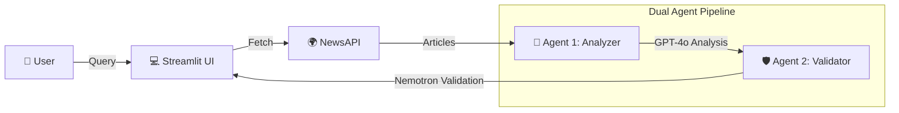

# 📰 News Analyzer with Dual LLM Validation

> **Celltron Intelligence - AI Engineer Assignment**  
> ⏱️ **Built in 2 hours** (Rapid Prototyping)  
> 🚀 **Deployable on:** [Vercel](https://vercel.com) (API) & [Streamlit Cloud](https://streamlit.io/cloud) (UI)

A news analysis pipeline that uses **OpenAI GPT-4o-mini** for primary analysis and **OpenRouter Nemotron** for cross-validation. Features a ChatGPT-style Streamlit UI with clickable articles.

---

## 👤 Author

**Vivek Kumar Yadav**  
🌐 Portfolio: [cv.vivekmind.com](https://cv.vivekmind.com)  
📂 GitHub: [github.com/Lnxtanx](https://github.com/Lnxtanx)

---

## ✨ Features

- **Dual LLM Pipeline**: OpenAI analyzes → OpenRouter/Nemotron validates
- **ChatGPT-Style UI**: Modern dark theme with interactive chat
- **Clickable Articles**: View source articles in new tab
- **Sentiment Analysis**: Positive/Negative/Neutral classification
- **Cross-validation**: Second LLM catches incorrect analysis
- **Rich Reports**: JSON + Markdown output formats

## 🔧 LLM Architecture

| Role | Provider | Model | Purpose |
|------|----------|-------|---------|
| **LLM#1 (Analyzer)** | OpenAI | `gpt-4o-mini` | Primary analysis - extracts gist, sentiment, tone |
| **LLM#2 (Validator)** | OpenRouter | `nvidia/nemotron-3-nano-30b-a3b:free` | Cross-validation - verifies accuracy |

### Why Two Different LLM Providers?

Using models from different providers (OpenAI vs Nemotron via OpenRouter) ensures genuine validation. Same-provider models share training biases, which would defeat the fact-checking purpose.

## 🚀 Quick Start

### Prerequisites
- Python 3.10+
- API keys for NewsAPI, OpenAI, and OpenRouter

### Installation

```bash
# Clone the repository
git clone https://github.com/Lnxtanx/News-Analysis-with-Dual-LLM-Validation-.git
cd News-Analysis-with-Dual-LLM-Validation-

# Create virtual environment
python -m venv venv
venv\Scripts\activate  # Windows
# source venv/bin/activate  # Linux/Mac

# Install dependencies
pip install -r requirements.txt
```

### Configuration

Create a `.env` file with your API keys:

```env
NEWSAPI_KEY=your_newsapi_key
OPENAI_API_KEY=your_openai_api_key
OPENROUTER_API_KEY=your_openrouter_api_key
```

**Get your API keys from:**
- NewsAPI: https://newsapi.org/
- OpenAI: https://platform.openai.com/api-keys
- OpenRouter: https://openrouter.ai/keys

### Run the Application

**Option 1: Streamlit Chat UI (Recommended)**
```bash
streamlit run app.py
```

Opens at `http://localhost:8501` with an interactive chat interface.

**Option 2: Flask API**
```bash
python main.py
```

The API server starts at `http://localhost:5000`

## 📡 API Endpoints

| Method | Endpoint | Description |
|--------|----------|-------------|
| GET | `/` | Status page |
| POST | `/analyze` | Run full analysis pipeline |
| GET | `/report` | Get latest Markdown report |
| GET | `/results` | Get latest JSON results |

## 🧪 Running Tests

```bash
python -m pytest tests/ -v
```

## 📁 Project Structure

```
news-analyzer/
├── app.py               # Streamlit Chat UI (recommended)
├── main.py              # Flask API
├── llm_analyzer.py      # LLM#1: OpenAI analysis module
├── llm_validator.py     # LLM#2: OpenRouter/Nemotron validation
├── news_fetcher.py      # NewsAPI integration
├── requirements.txt     # Dependencies
├── .env                 # API keys (not in repo)
├── .gitignore
├── DEVELOPMENT_PROCESS.md  # Development thinking & AI prompts
├── output/              # Generated reports
└── tests/
    └── test_analyzer.py  # 7 meaningful test cases
```

## 🏗️ Architecture (Built in 2 Hours)
This project was architected and built in just 2 hours using a modular agentic approach.



### The "Double-Agent" Logic
1.  **Fetcher**: Retrieves raw articles from trusted sources.
2.  **Agent 1 (Analyzer)**: Uses **OpenAI GPT-4o-mini** to read the articles and extract "gist", sentiments, and tones. 
3.  **Agent 2 (Validator)**: Uses **Nemotron-3-8B** (via OpenRouter) to "grade" Agent 1's work. It checks for hallucinations or bias.
4.  **UI**: Visualizes this entire flow with a "Pipeline Inspector" so users can see the raw data vs. validated data.

## ☁️ Deployment Guide

### Option 1: Vercel (API Backend)
The Flask API (`main.py`) is configured for Vercel.
1. Install Vercel CLI: `npm i -g vercel`
2. Run `vercel` in this directory.
3. Add Environment Variables in Vercel Dashboard (`NEWSAPI_KEY`, etc.).

### Option 2: Streamlit Cloud (Chat UI)
For the full UI experience (`app.py`):
1. Push to GitHub.
2. Go to [share.streamlit.io](https://share.streamlit.io).
3. Connect repo and point to `app.py`.
4. Add secrets in the Streamlit dashboard advanced settings.

## 📝 License

MIT License

---

Made with ❤️ by [Vivek](https://cv.vivekmind.com)
